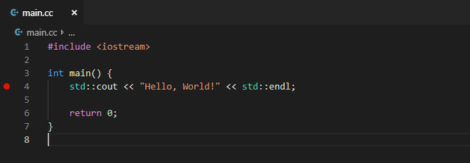
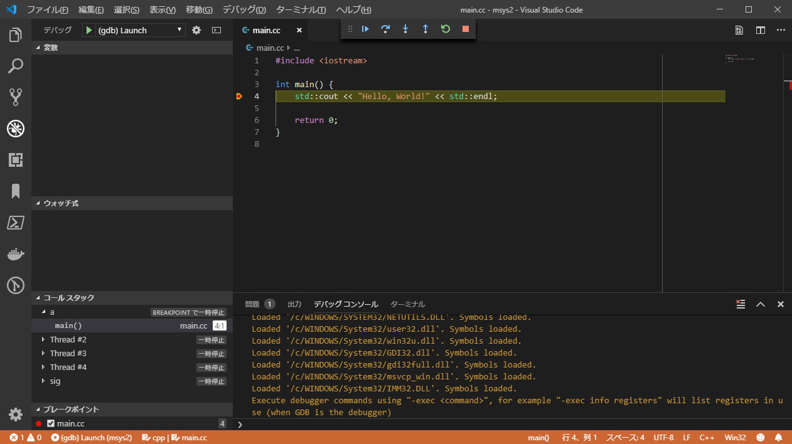

# Visual Studio Code による GUI デバッグ

Visual Studio Code から GDB を使用することで GUI デバッグすることができます。

## launch.json の設定

Visual Studio Code を起動している状態で `Ctrl+Shift+P` を押すとコマンドパレットが開きます。
コマンドパレットに `Debug: Open launch.json` と入力して `launch.json` を開きます。

`launch.json` が存在しない場合には `環境の選択` というダイアログが出るので
`C++ (GDB/LLDB)` を選択することで次のような内容の `launch.json` が生成されます。

```json
{
    // IntelliSense を使用して利用可能な属性を学べます。
    // 既存の属性の説明をホバーして表示します。
    // 詳細情報は次を確認してください: https://go.microsoft.com/fwlink/?linkid=830387
    "version": "0.2.0",
    "configurations": [
        {
            "name": "(gdb) Launch",
            "type": "cppdbg",
            "request": "launch",
            "program": "enter program name, for example ${workspaceFolder}/a.exe",
            "args": [],
            "stopAtEntry": false,
            "cwd": "${workspaceFolder}",
            "environment": [],
            "externalConsole": true,
            "MIMode": "gdb",
            "miDebuggerPath": "/path/to/gdb",
            "setupCommands": [
                {
                    "description": "Enable pretty-printing for gdb",
                    "text": "-enable-pretty-printing",
                    "ignoreFailures": true
                }
            ]
        }
    ]
}
```

生成された `launch.json` を次のように編集します。

- デバッグ対象のプログラムのパスを設定する
    - `${workspaceFolder}` で Visual Studio Code で開いているフォルダを指定できます。
- gdb のパスを設定する
    - msys2 のインストールパス配下の `usr/bin/gdb.exe` を指定します。
    - msys2 のインストールパスはデフォルトでは `C:/msys64` です。
- sourceFileMap を追加する
    - GDB から取得するファイルパスを Windows のパスに変換するための設定です。
    - Windows のドライブレター `C:/` は msys2 では `/c/` として扱われます。

```json hl_lines="8 15 23 24 25"
{
    "version": "0.2.0",
    "configurations": [
        {
            "name": "(gdb) Launch",
            "type": "cppdbg",
            "request": "launch",
            "program": "${workspaceFolder}/a.exe",
            "args": [],
            "stopAtEntry": false,
            "cwd": "${workspaceFolder}",
            "environment": [],
            "externalConsole": true,
            "MIMode": "gdb",
            "miDebuggerPath": "C:/msys64/usr/bin/gdb.exe",
            "setupCommands": [
                {
                    "description": "Enable pretty-printing for gdb",
                    "text": "-enable-pretty-printing",
                    "ignoreFailures": true
                }
            ],
            "sourceFileMap": {
                "/c/": "C:/"
            }
        }
    ]
}
```

## デバッグ開始

コマンドパレットに `Debug: Start Debugging` と入力すると
デバッグ対象プログラムを開始します。

Visual Studio Code を起動している状態で `F5` を押すことでも
デバッグ対象プログラムを開始できます。

ブレークポイントが設定されていない状態だとプログラム終了まで実行されます。

## ブレークポイントの追加と削除

行番号の左側をクリックすることでブレークポイントを追加できます。



もう一度クリックするとブレークポイントを削除できます。

## プログラムの一時停止

ブレークポイントを追加した状態でデバッグを開始すると、
ブレークポイントに到達した時点でプログラムが一時停止します。



## デバッグツールバー


左から順に以下の操作を行うことができます。

- プログラムの再開
- ステップオーバー
- ステップイン
- ステップアウト
- 再起動
- デバッグ終了

## 参考

- [Debugging in Visual Studio Code]

[Debugging in Visual Studio Code]: https://code.visualstudio.com/docs/editor/debugging
